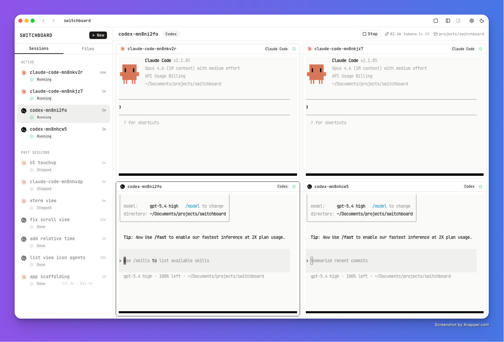

# Switchboard

**Run a team of AI coding agents from one window.**

<p align="center">
  
</p>

Switchboard is an open-source desktop app for managing multiple AI coding agents (Claude Code, Codex) in parallel. Each agent gets its own interactive terminal — exactly like running it natively — with session management, git worktree isolation, and a built-in git panel on top.

Think [Conductor](https://www.conductor.build/), but open source.

## Why

You're already using Claude Code or Codex in your terminal. But when you want to run three agents on three different tasks — or compare how two agents approach the same problem — you're juggling terminal windows, worktrees, and context switching manually.

Switchboard gives you:

- **Multiple interactive sessions** — each agent runs in a real PTY terminal, identical to your native CLI experience
- **Session sidebar** — see all agents at a glance, which are running, which need your input
- **Git worktree isolation** — each session can get its own worktree so agents don't step on each other
- **Git panel** — stage, commit, push, and create PRs without leaving the app (Codex app style)
- **Session persistence** — reads your existing Claude Code history from `~/.claude/projects/`, resume any past session with one click
- **Keyboard-driven** — `Ctrl+1..9` to switch sessions, `Ctrl+N` for new, `Ctrl+G` for git panel, `Escape` to focus terminal

## Status

Early alpha. The core works — you can spawn Claude Code and Codex sessions, interact with them, switch between them, manage git, and resume past sessions. Building in public.

**What's working (M1):**
- Interactive terminal sessions via PTY (portable-pty → xterm.js)
- Agent picker (Claude Code / Codex / Bash)
- Session sidebar with status indicators
- Past session loading from Claude Code's local storage
- Session resume via `claude --resume`
- Git panel with diff viewer, staging, commit, push
- Git worktree management
- Keyboard shortcuts
- Session persistence across app restarts

**Coming next (M2):**
- Comparison mode — same task to different agents, side-by-side diff
- Stream View — all terminals visible in a horizontal scroll
- File tree viewer
- Token usage / cost tracking
- Background (non-interactive) agents

## Getting Started

### Prerequisites

- [Node.js](https://nodejs.org/) 20+
- [Rust](https://www.rust-lang.org/tools/install) 1.77+
- [Tauri CLI prerequisites](https://v2.tauri.app/start/prerequisites/) (platform-specific)
- At least one of: [Claude Code](https://docs.anthropic.com/en/docs/claude-code), [Codex](https://github.com/openai/codex)

### Development

```bash
git clone https://github.com/nsoybean/switchboard.git
cd switchboard
npm install
npm run tauri dev
```

### Build

```bash
npm run tauri build
```

Produces `.dmg` (macOS) or `.AppImage` (Linux) in `src-tauri/target/release/bundle/`.

## Tech Stack

| Layer | Technology |
|-------|-----------|
| Desktop framework | [Tauri v2](https://v2.tauri.app/) (Rust) |
| Frontend | React 19 + TypeScript + Tailwind CSS |
| Terminal emulation | [xterm.js](https://xtermjs.org/) v6 + WebGL addon |
| PTY management | [portable-pty](https://crates.io/crates/portable-pty) (custom Tauri commands) |
| Git operations | Git CLI subprocess |
| State management | React Context + useReducer |
| Session data | Reads from `~/.claude/projects/` (Claude Code) + `~/.switchboard/sessions.json` (own metadata) |

### Architecture

```
┌──────────────────────────────────────────────────┐
│              FRONTEND (React + xterm.js)          │
│                                                  │
│  Sidebar ─── Terminal (xterm.js) ─── Git Panel   │
│                      │                           │
│               usePty hook                        │
│                      │ Tauri events              │
├──────────────────────┼───────────────────────────┤
│              BACKEND (Rust / Tauri v2)            │
│                                                  │
│  PTY commands ── Session commands ── Git commands │
│  (portable-pty)  (persistence)    (git CLI)      │
│                      │                           │
│         ┌────────────┼────────────┐              │
│         ▼            ▼            ▼              │
│  ~/.claude/     git worktree  ~/.switchboard/    │
│  (read only)       CLI        sessions.json      │
└──────────────────────────────────────────────────┘
```

The PTY pipeline is the core — `portable-pty` spawns agent processes, a background thread streams output via Tauri events to xterm.js, and user keystrokes flow back. The terminal renders identically to running the agent in your native terminal.

### Design

- **Font:** JetBrains Mono
- **Spacing:** 4px base unit
- **Aesthetic:** Terminal-native, dark, dense, minimal chrome
- **Colors:** CSS variables prefixed with `--sb-` for future theming

## Contributing

Contributions welcome. This is an early-stage project — if you're interested in multi-agent workflows, git worktree tooling, or terminal emulation in desktop apps, there's plenty to work on.

```bash
# Run Rust tests
cargo test --manifest-path src-tauri/Cargo.toml

# TypeScript check
npx tsc --noEmit
```

## License

MIT
