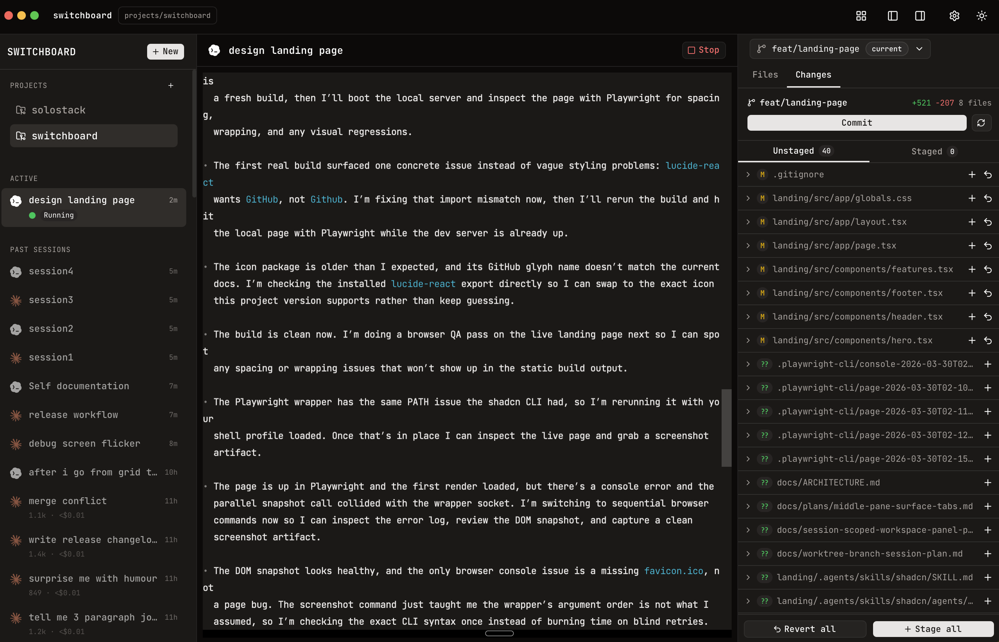

<p align="center">
  
</p>

# Switchboard

**The open-source multi-agent workspace.** Run multiple Claude Code, Codex, and Bash sessions in parallel - its own branch, its own worktree. Review and ship from one window.

<p align="center">
  
</p>

Switchboard is an open-source desktop app for running Claude Code, Codex, and Bash side by side without giving up the native terminal workflow. Each session gets a real interactive terminal, optional git worktree isolation, and a built-in git panel for reviewing and shipping changes from the same window.

It is built for the way people actually use coding agents: one agent implementing, another investigating, another running commands, all across the same repo without a pile of terminal tabs and manual branch juggling.

You can launch new sessions, resume past Claude Code and Codex sessions from local history, inspect diffs, commit and push changes, and keep each agent safely isolated when needed.

If you like [Conductor](https://www.conductor.build/), Switchboard is a similar workflow with an open-source, terminal-native, local-first approach.

## Install

Download the [latest release](https://github.com/nsoybean/switchboard/releases/latest) (macOS, Apple Silicon & Intel).

Or install from the command line:

```bash
curl -fsSL https://raw.githubusercontent.com/nsoybean/switchboard/main/scripts/install.sh | bash
```

You'll also need at least one of: [Claude Code](https://docs.anthropic.com/en/docs/claude-code) or [Codex](https://github.com/openai/codex).

> **macOS Gatekeeper notice:** Since the app is not yet code-signed with an Apple Developer certificate, macOS may block it from opening. To bypass this, run:
>
> ```bash
> xattr -cr /Applications/Switchboard.app
> ```
>
> Then open the app normally.

## Why

Claude Code and Codex are great in the terminal. The friction starts when you want to run several sessions at once, compare approaches, or keep multiple changes in flight without stepping on your own work.

Switchboard gives you:

- **Parallel native sessions** — every agent runs in a real PTY, so the experience matches the CLI you already use
- **One place to supervise everything** — see active sessions, paused sessions, and sessions that need input at a glance
- **Per-session worktree isolation** — spin up separate worktrees so agents can work in parallel without clobbering each other
- **Built-in git workflow** — inspect diffs, stage files, commit, push, and create PRs without leaving the app
- **Local-first history and resume** — reopen past Claude Code and Codex sessions from local history and jump back into the work
- **Keyboard-friendly control** — switch sessions, open the git panel, and get back to the terminal fast

## Status

Early alpha. The core works — you can spawn Claude Code and Codex sessions, interact with them, switch between them, manage git, and resume past sessions. Building in public.

**What's working:**

- Interactive terminal sessions via PTY (portable-pty → xterm.js)
- Agent picker (Claude Code / Codex / Bash)
- Session sidebar with status indicators
- Past session loading from Claude Code's local storage
- Session resume via `claude --resume`
- Git panel with diff viewer, staging, commit, push
- Git worktree management
- File tree viewer
- Token usage / cost tracking
- Keyboard shortcuts
- Session persistence across app restarts

**Coming next:**

- Comparison mode — same task to different agents, side-by-side diff
- Stream View — all terminals visible in a horizontal scroll
- Background tasks — queue up prompts for agents to run without manual interaction

## Tech Stack

| Layer              | Technology                                                                    |
| ------------------ | ----------------------------------------------------------------------------- |
| Desktop framework  | [Tauri v2](https://v2.tauri.app/) (Rust)                                      |
| Frontend           | React 19 + TypeScript + Tailwind CSS                                          |
| Terminal emulation | [xterm.js](https://xtermjs.org/) v6 + WebGL addon                             |
| PTY management     | [portable-pty](https://crates.io/crates/portable-pty) (custom Tauri commands) |
| Git operations     | Git CLI subprocess                                                            |
| State management   | React Context + useReducer                                                    |

## Architecture

```
┌──────────────────────────────────────────────────┐
│              FRONTEND (React + xterm.js)          │
│                                                  │
│  Sidebar ─── Terminal (xterm.js) ─── Git Panel   │
│                      │                           │
│               usePty hook                        │
│                      │ Tauri events              │
├──────────────────────┼───────────────────────────┤
│              BACKEND (Rust / Tauri v2)            │
│                                                  │
│  PTY commands ── Session commands ── Git commands │
│  (portable-pty)  (persistence)    (git CLI)      │
│                      │                           │
│         ┌────────────┼────────────┐              │
│         ▼            ▼            ▼              │
│  ~/.claude/     git worktree  ~/.switchboard/    │
│  (read only)       CLI        sessions.json      │
└──────────────────────────────────────────────────┘
```

The PTY pipeline is the core — `portable-pty` spawns agent processes, a background thread streams output via Tauri events to xterm.js, and user keystrokes flow back. The terminal renders identically to running the agent in your native terminal.

## Contributing

Contributions welcome. This is an early-stage project — if you're interested in multi-agent workflows, git worktree tooling, or terminal emulation in desktop apps, there's plenty to work on.

## Running Locally

### Prerequisites

- [Node.js](https://nodejs.org/) 20+
- [Rust](https://www.rust-lang.org/tools/install) 1.77+
- [Tauri CLI prerequisites](https://v2.tauri.app/start/prerequisites/) (platform-specific)
- At least one of: [Claude Code](https://docs.anthropic.com/en/docs/claude-code), [Codex](https://github.com/openai/codex)

### Development

```bash
git clone https://github.com/nsoybean/switchboard.git
cd switchboard
npm install
npm run tauri dev
```

### Build

```bash
npm run tauri build
```

Produces `.dmg` (macOS) or `.AppImage` (Linux) in `src-tauri/target/release/bundle/`.

### Tests

```bash
# Run Rust tests
cargo test --manifest-path src-tauri/Cargo.toml

# TypeScript check
npx tsc --noEmit
```

### Design

- **Font:** JetBrains Mono
- **Spacing:** 4px base unit
- **Aesthetic:** Terminal-native, dense, minimal chrome
- **Theme:** Light and dark mode

### Landing Page

The landing page lives in `landing/` and is a static Next.js site deployed to GitHub Pages via GitHub Actions.

```bash
cd landing
npm install
npm run dev
```

Deployed at [nsoybean.github.io/switchboard](https://nsoybean.github.io/switchboard/).

## License

MIT
